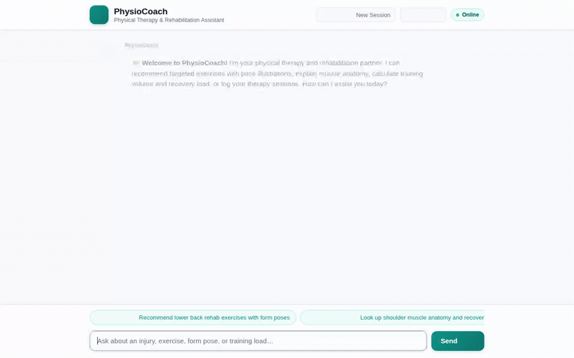

# 🏋️ PhysioCoach — Physical Therapy & Rehabilitation Assistant

> An intelligent clinical physical therapy assistant built on Google Cloud Agent Platform, Vertex AI, and ADK. PhysioCoach designs personalized injury recovery routines, tracks patient pain and workout progression across sessions, synthesizes visual exercise pose illustrations, and renders rich, interactive A2UI clinical cards.

<div align="center">



</div>

---

## 📖 Overview

PhysioCoach is an agentic rehabilitation companion designed to guide users through injury recovery and safe mobility training. Rather than providing generic workout advice, PhysioCoach integrates clinical safety guidelines, remembers patient injury history and contraindications across conversations, computes training load and volume progression, queries an active exercise database, and generates visual pose illustrations and demonstration media.

---

## 🛠️ Wired Tools & Google Cloud Services

The capabilities below are fully wired up and implemented in the repository codebase:

| Capability / Service | Implementation in Code | Description |
| :--- | :--- | :--- |
| **Long-Term Memory**<br>*(Vertex AI Memory Bank)* | `PreloadMemoryTool`<br>`generate_memories_callback` | Persists patient injury history, pain symptoms, rehab preferences, and contraindications/allergies across sessions. Automatically recalled at turn start and extracted at turn end. |
| **Rehabilitation Database**<br>*(Cloud Firestore)* | `list_exercises`<br>`get_exercise_details`<br>`add_exercise`<br>`log_workout_session` | Reads and writes rehabilitation exercises, form cues, safety precautions, and patient workout session logs (sets, reps, pain score 0–10). |
| **Visual Pose Generation**<br>*(Vertex AI Gemini 3.1 Flash Image)* | `generate_exercise_pose_image` | Synthesizes clinically accurate exercise pose illustrations with a consistent athletic persona and clinical studio setting, saving artifacts to the ADK session and uploading to Cloud Storage. |
| **Exercise Video Synthesis**<br>*(Vertex AI Gemini Omni)* | `generate_exercise_demo_video` | Generates exercise form demonstration videos using `gemini-omni-flash-preview` in the `global` region, persisted via `tool_context.save_artifact` and hosted on Cloud Storage. |
| **Media Hosting**<br>*(Google Cloud Storage)* | `storage.Client`<br>`physiocoach-media-*` public bucket | Stores generated exercise pose images and demonstration videos with direct public HTTPS URLs for inline rendering in A2UI cards. |
| **Rich Clinical UI**<br>*(A2UI - Agent-to-UI)* | `a2ui_callback`<br>`A2uiSchemaManager` (v0.8) | Emits structured A2UI cards, columns, formatted text, and images instead of raw text, rendering responsive rehabilitation cards in the UI. |
| **Code Sandbox**<br>*(Vertex AI Sandbox)* | `AgentEngineSandboxCodeExecutor`<br>`calculate_training_load` | Safely executes Python code in a secure Vertex AI sandbox to calculate volume load (sets × reps) and evaluate progression pacing against pain scores. |
| **Anatomical Reference** | `lookup_muscle_anatomy` | Fetches Latin anatomical terminology, muscle origins, anterior/posterior classifications, and biomechanical actions. |

> **Planned, Not Yet Implemented**:
> - *Multimodal Patient Form Camera Inspection*: Real-time camera or recorded video input to inspect and correct user exercise form.

---

## 🏗️ Architecture

```
User (Browser)
    │
    ▼
FastAPI Proxy (A2A Protocol / Cloud Run)
    │
    ▼
Agent Engine / Agent Runtime (Reasoning Engine: gemini-3.6-flash)
    ├── PreloadMemoryTool ──────► Vertex AI Memory Bank (Cross-session memory)
    ├── Exercise Tools ─────────► Google Cloud Firestore (Collections: exercises, workout_logs)
    ├── Pose Generator ─────────► Vertex AI Image Generation + Cloud Storage
    ├── Omni Video Generator ───► Vertex AI Omni (gemini-omni-flash-preview) + Cloud Storage
    ├── Code Executor ──────────► Vertex AI Code Sandbox (Volume & Load Analysis)
    └── Output Formatter ───────► A2UI (Cards, Columns, Images)
```

---

## 💻 Local Setup & Running Instructions

### 1. Prerequisites
- Python 3.11+
- Google Cloud SDK (`gcloud`) authenticated with a project having Vertex AI, Firestore, and Cloud Storage APIs enabled:
  ```bash
  gcloud auth login
  gcloud auth application-default login
  gcloud config set project <YOUR_PROJECT_ID>
  ```

### 2. Environment Configuration
Create a `.env` file in the project directory:
```bash
PROJECT_ID="<YOUR_PROJECT_ID>"
BUCKET_NAME="<YOUR_PUBLIC_GCS_BUCKET>"
FIRESTORE_DATABASE="(default)"
```

### 3. Run the Agent Locally (ADK Web)
Install project dependencies and start the interactive ADK local playground:
```bash
cd physio-coach
uv sync
uv run adk web app
```

### 4. Run the Web Frontend Locally
The frontend includes a FastAPI proxy talking A2A and a modern chat UI:
```bash
cd physio-coach/frontend
pip install -r requirements.txt
export AGENT_ENGINE_RESOURCE_NAME="projects/<PROJECT_NUM>/locations/<REGION>/reasoningEngines/<REASONING_ENGINE_ID>"
export AGENT_DIRECTORY="app"
python main.py
```
Open a browser to the local server port displayed in the console output (default: 8080).

---

## 📜 Development & Conversation Archive

The complete pair-programming dialogue and development history between the developer and Antigravity (Google DeepMind) is archived in the repository:
- **Readable Dialogue Log**: [`archive/CONVERSATION_ARCHIVE.md`](./archive/CONVERSATION_ARCHIVE.md)
- **Raw Structured Transcript**: [`archive/conversation_transcript.jsonl`](./archive/conversation_transcript.jsonl)
